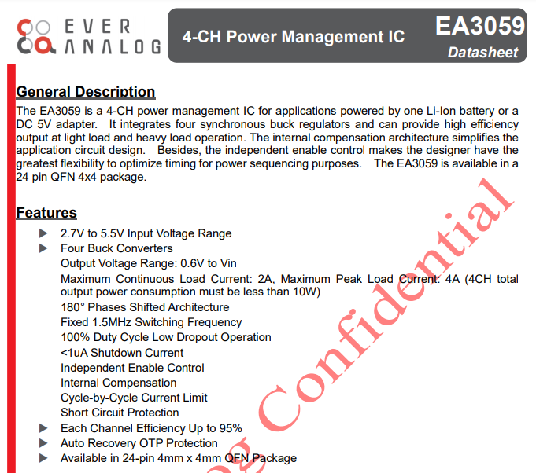
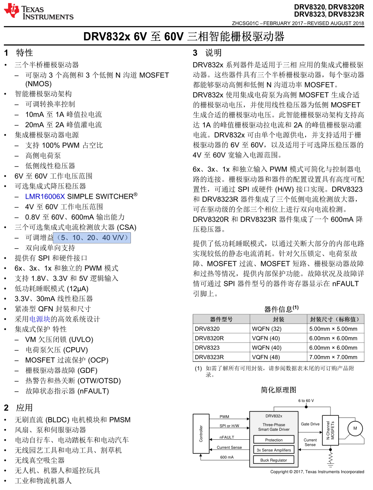
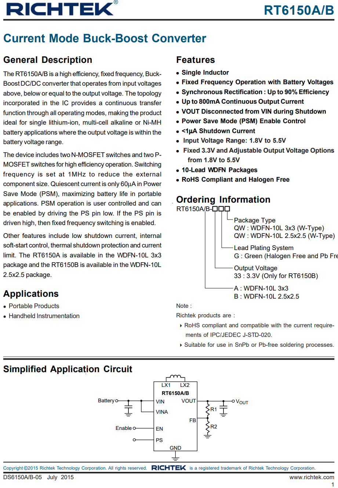
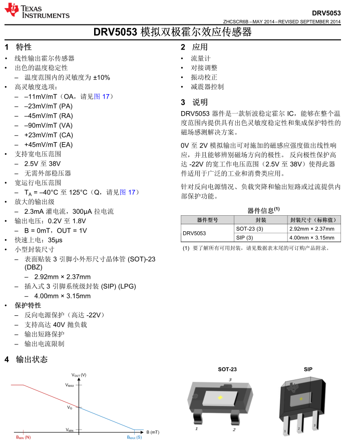
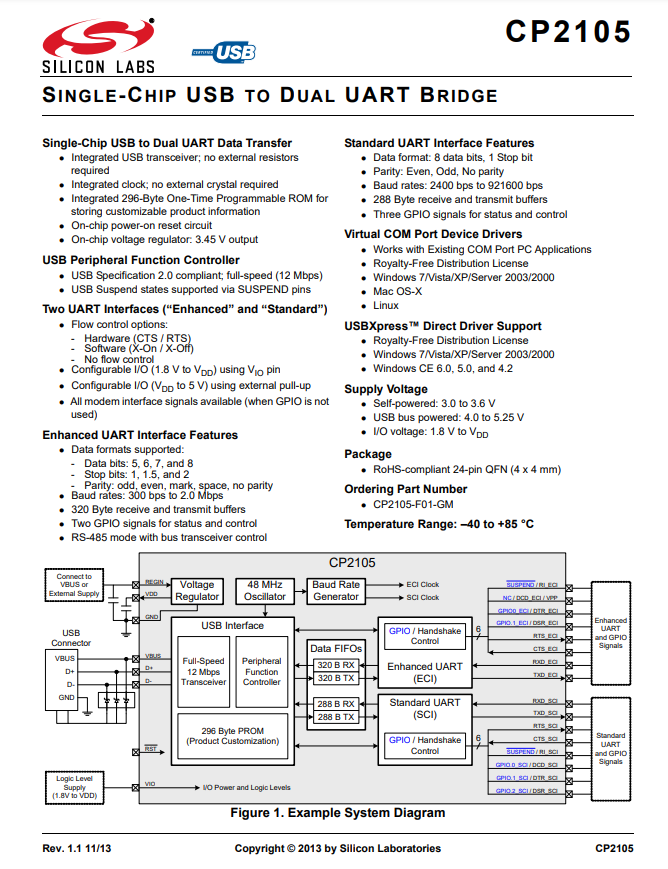

# EA3059 - 4通道电源

一个小尺寸4通道电源芯片，最高输入电压5.5V，4路总功率10W（5V，2A）。多用于SOC供电。

还有3通道的型号：EA3036C，代替型号：A4003C

# DRV8323RS - 集成电源，三路低侧采样运放的三相栅极驱动器

一个集成开关电源，3路低侧电流检测放大器的三相栅极驱动器。支持6x、3x、1x 和独立输入 PWM 模式。4V 至 60V 工作电压范围。运放增益可配置（5、10、20、40 V/V）

# RT6150 - 单锂电池自动升降压芯片

支持1.8-5.5v输入，固定3.3V或可调输出，800mA连续电流

# DRV5053 - 模拟霍尔传感器

一个在DJI无刷电机中常用的霍尔传感器，用两个霍尔相隔90°摆放组成位置式编码器

# CP2105 - USB双串口

一个USB转双串口芯片，一个标准串口，一个增强型串口。IO电平支持1.8~3.6V

